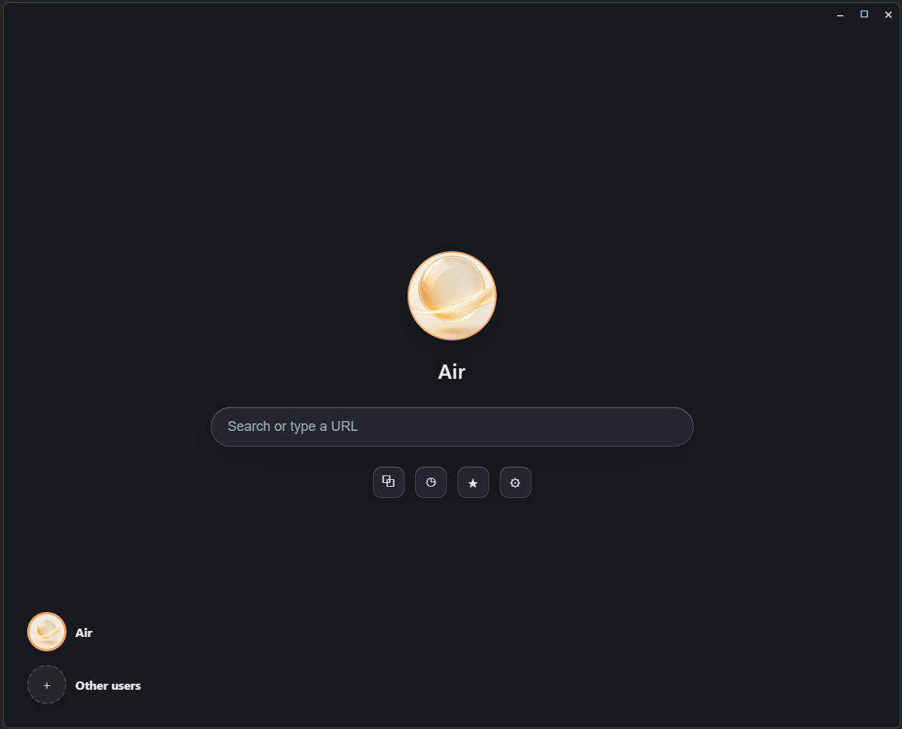
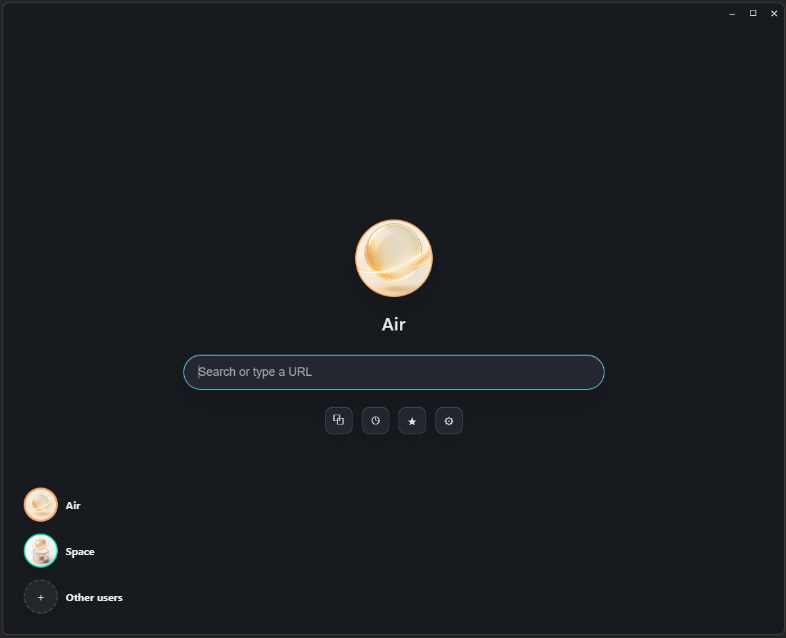
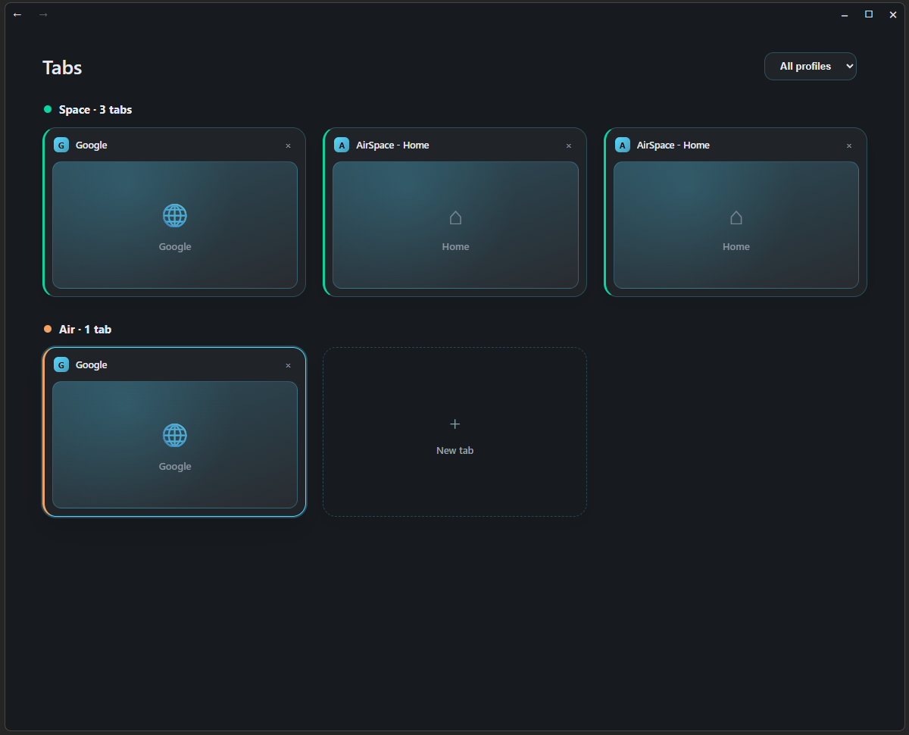
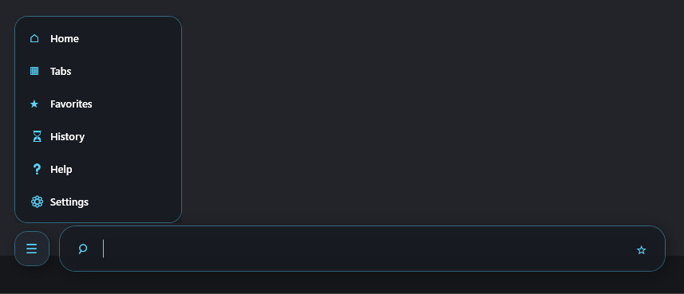
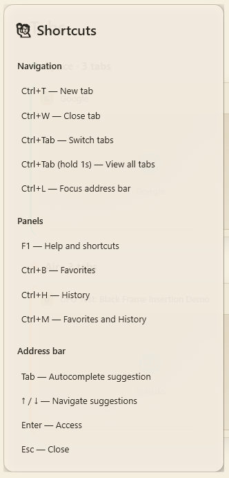
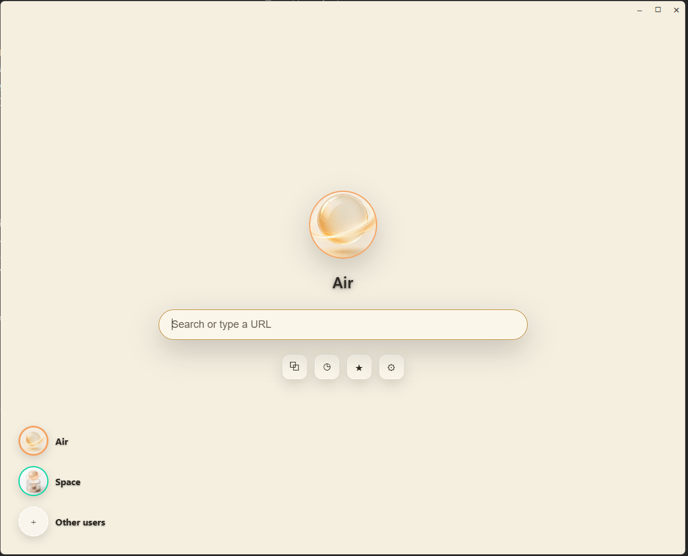
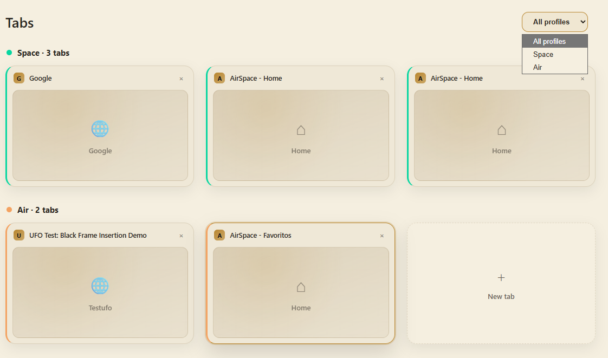

# AirSpace Browser

### Um navegador focado em leveza, privacidade e perfis isolados.

[⬇ Baixar agora](https://github.com/Luc0BR/AirSpace-Browser-Releases/releases/latest) · [✨ Funcionalidades](#-funcionalidades) · [📸 Capturas de tela](#-capturas-de-tela) · [🚀 Instalação](#-instalação)

---

## 💡 Sobre

**AirSpace** é um navegador desktop construído do zero para quem quer simplicidade sem abrir mão de controle. Nada de inchaço, telemetria escondida ou dezenas de configurações desnecessárias — só o essencial, bem feito: **navegação rápida, perfis totalmente isolados uns dos outros, e as suas senhas guardadas com você, não na nuvem de ninguém.**

Construído em **.NET / WPF** com o motor **Microsoft Edge WebView2**, o AirSpace roda nativamente no Windows com o mesmo motor de renderização do Edge/Chrome — ou seja, compatibilidade total com a web moderna, com uma interface pensada do zero.

---

## ✨ Funcionalidades

| | |
|---|---|
| 👤 **Perfis Múltiplos** | Crie quantos perfis quiser (trabalho, pessoal, cliente X, cliente Y...). Cada perfil tem sessão, cookies e cache **totalmente isolados** — like navegar em "modo anônimo" permanente entre contextos diferentes. |
| 🔒 **Cofre de Senhas** | Um cofre de senhas próprio, protegido por PIN e perguntas de segurança, com criptografia local via DPAPI do Windows. Suas senhas nunca saem da sua máquina. |
| 🧩 **Sessões Isoladas** | Cada perfil roda seu próprio ambiente do WebView2 — sem vazamento de cookies ou login entre perfis diferentes, mesmo com o navegador todo aberto ao mesmo tempo. |
| 🗂️ **Sistema de Abas** | Abas de verdade, com atalhos de teclado rápidos, visual em grade (estilo seletor do Safari/iOS) agrupado por perfil, e troca instantânea entre elas. |
| ⭐ **Favoritos & Histórico** | Favorite qualquer página com um clique na estrela flutuante. Histórico organizado, pesquisável e com limpeza seletiva por período. |
| 🌐 **Multi-idioma** | Interface 100% traduzida, com arquitetura extensível — novos idiomas são adicionados com um simples arquivo `.json`, sem precisar recompilar nada. |
| 🔄 **Atualização automática** | O AirSpace se atualiza sozinho em segundo plano, sem telas de instalação, sem perder suas abas abertas nem seus perfis. Você é avisado no changelog quando termina. |

---

## 📸 Capturas de tela

---

## 🚀 Instalação

1. Acesse a [página de releases](https://github.com/Luc0BR/AirSpace-Browser-Releases/releases/latest)
2. Baixe o arquivo **`AirSpace-win-Setup.exe`**
3. Execute o instalador — o Windows pode exibir um aviso do SmartScreen (o instalador ainda não é assinado digitalmente); clique em **"Mais informações" → "Executar assim mesmo"**
4. Pronto! O AirSpace abre automaticamente após a instalação, e um atalho é criado na Área de Trabalho e no Menu Iniciar

A partir daí, **você nunca mais precisa baixar nada manualmente** — o AirSpace verifica e aplica atualizações sozinho, silenciosamente, no fundo.

### Requisitos

- Windows 10 ou Windows 11 (64-bit)
- Sem suporte a Linux ou macOS no momento — não há previsão para essas plataformas

---

## ⌨️ Atalhos principais

| Atalho | Ação |
|---|---|
| `Ctrl + T` | Nova aba |
| `Ctrl + W` | Fechar aba |
| `Ctrl + Tab` | Alternar entre abas |
| `Ctrl + Tab` (segurar) | Ver todas as abas em grade |
| `Ctrl + L` | Focar na barra de endereço |
| `Ctrl + B` | Favoritos |
| `Ctrl + H` | Histórico |
| `Ctrl + M` | Favoritos e Histórico |
| `F1` | Ajuda e atalhos |

---

## 🗺️ Roadmap

- [ ] Perfil dedicado com proxy/Tor integrado, para navegação anônima por rede
- [ ] Renovação visual de Favoritos e Histórico
- [ ] Suporte a mais idiomas
- [ ] Sincronização opcional entre dispositivos

---

## 🛠️ Sobre este repositório

Este repositório contém **apenas os binários de distribuição** do AirSpace (instaladores e atualizações). O código-fonte é mantido em um repositório privado separado.

Encontrou um problema ou tem uma sugestão? Abra uma [issue](https://github.com/Luc0BR/AirSpace-Browser-Releases/issues) por aqui.

---

Feito com 💙 por **LUC0ti**

